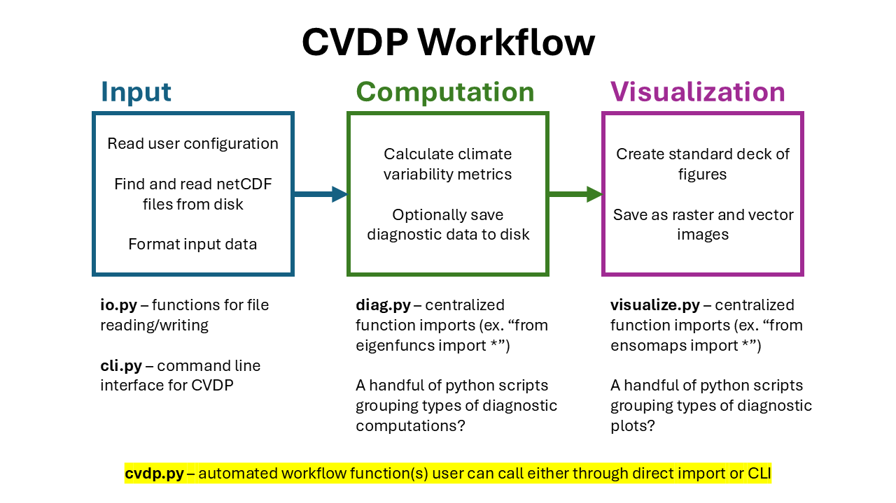

# CVDP Developer's Guide
This guide contains information on how to test and contribute to the CVDP. It is not intended as a tutorial for users who want to run the CVDP on their own data. Please see the **User Tutorial** (to be created) if you are running the CVDP for the first time.

This is a living document and development is ongoing.

(Cameron) To-Do:
1. Add automated test workflow
2. Create example yml config and fix time_bnd bug
3. Finish CVDPNotebook implementation

## Workflow and Software Design



The CVDP workflow is divided into three modules which are stored in directories and Python scripts:

 - **Input** - handles all user input, reading YML configuration, and loading netCDF files from disk. This is a small module, so it encapsulated into a single Python script.
 - **Computation** - performs all of the calculations for generating diagnostic metrics from the meta-data rich `xarray.DataArray` objects generated by the **Input** module. Each metric calculation is described by a Python function and similar metrics are grouped into Python scripts under the `cvdp/computation/`. Functions are then aggregated via import statements in `diag.py` to handle function naming and offer a simpler API.
 - **Visaualization** - generates graphs, maps, and other figures from the `xarray.DataArray` objects produced by the **Computation** module. Functions generate customizeable `matplotlib.figure.Figure` objects for individual metrics. Figures with similar metrics and content are grouped into Python scripts uner `cvdp/visualization` and imported in `vis.py` for the same reasons as `diag.py` described above.

`cvdp.py` serves as the entry point for the software when executed as a standalone tool. The user can import this module into a Python environment and can automatically generate an assortment of diagnostic output by supplying a YML configuration file.

`cli.py` handles the `cvdp` command that is added to the execution environment when the package is fully installed. It wraps functions `cvdp.py` and creates a useful command-line interface as an alternative to working in a Python environment.

`utils.py` contains utility functions that handle auxillary tasks such as logging or obtaining the package version for use throughout the package.

`definitions.py` contains constant values such as asset paths or default configuration values that are used throughout the package.

## Example 1: Adding a new diagnostic metric
For this example, let's add some *seasonal climatologies* metrics to the CVDP. 

### Creating the Python file

First, we create a file called `climatology.py` in `/cvdp/computations/`. This will contain the functions for each metric. Here is what the header could look like:
```
#!/usr/bin/env python
"""
climatology.py

CVDP functions for calculating climatological means and standard deviations.
License: MIT
"""
import xarray


CLIMATOLOGY_SEASON_MONTHS = {
    "DJF": [12, 1, 2],
    "JFM": [1, 2, 3],
    "MAM": [3, 4, 5],
    "JJA": [6, 7, 8],
    "JAS": [7, 8, 9],
    "SON": [9, 10, 11],
    "ANN": [1, 2, 3, 4, 5, 6, 7, 8, 9, 10, 12]
}
```
Notice the first line (called the "shebang) `#!/usr/bin/env python3` specifies the Python3 environment should be used. This is a useful habit to include in all Python scripts and ensures portability between machines. The header (called a "docustring") provides a short description and license used. We put all imports at the top of script and define constants that are used by *more than one function* within the file. It can also be useful for the user to import these constants (they could do this via `cvdp.computations.climatology.CLIMATOLOGY_SEASON_MONTHS`. In this example, we define different seasonal codes with the integer values of the months they represent.

Now we can create some functions to calculate the metrics:
```
def compute_seasonal_avgs(var_data: xarray.DataArray, seasons: dict=CLIMATOLOGY_SEASON_MONTHS) -> xarray.DataArray:
    """
    Computes the sesonal averages for a given time series variable.
    
    :param var_data: Variable DataArray to compute the seasonal averages for.
    :type var_data: xarray.DataArray
    :param seasons: (Optional) Dictionary that maps the seasonal code (key) to its respective month integers (values)
    :type seasons: dict
    :return: Variable DataArray with the 'time' dimension reduced to seasons and their average values.
    :rtype: xarray.DataArray
    """
    monthly_avgs = var_data.groupby("time.month").mean().rename(f"{var_data.name}_avg")
    seasonal_avgs = []
    for season_label in CLIMATOLOGY_SEASON_MONTHS:
        season_months = CLIMATOLOGY_SEASON_MONTHS[season_label]
        seasonal_avgs.append(monthly_avgs.sel(month=season_months).mean(dim="month"))
    return xarray.concat(seasonal_avgs, dim=xarray.DataArray(data=list(CLIMATOLOGY_SEASON_MONTHS.keys()), dims=["season"]))

```
Let's break this down:
```
def compute_seasonal_avgs
```
Following convention, the function name should be descriptive, use only lowercase with underscores, and avoid too many short-hand names (so that outside developers can better understand).
```
def compute_seasonal_avgs(var_data, seasons=CLIMATOLOGY_SEASON_MONTHS)
```
The first function argument(s) should expect one (or several for multiple arguments) `xarray.DataArray` object that will be provided by the **Input** module. For climatological averages, we don't care which climate variable is being used, so we use the ambigous name `var_data` to suggest that. In other cases, a more specific name could be used to suggest only certain variables are appropriate and this can be further enforced using `assert` statements. Note that the `seasons` variable, which will specify which months to average together, has a default value equal to our constant that was set at the beginning of the script. By making this a parameter, the user can optionally override this default setting, giving our function more customizability.
```
def compute_seasonal_avgs(var_data: xarray.DataArray, seasons: dict=CLIMATOLOGY_SEASON_MONTHS) -> xarray.DataArray:
```
Type hints are useful for indicating what type of variable should be supplied to the function. Python does not enforce types, so these hints do nothing in execution but can be helpful for developers aiming to use the function correctly. At the very least, it makes the code more transparent. The `->` at the end of the arguments indicates the type of object returned by this function. For all **Computation** functions, they should take in `xarray.DataArray` objects and output `xarray.DataArray` objects to remain consistent with the workflow (this will allow the **Visualization** to work with the output and permit chaining multiple metric operations together).
```
    """
    Computes the sesonal averages for a given time series variable.
    
    :param var_data: Variable DataArray to compute the seasonal averages for.
    :type var_data: xarray.DataArray
    :param seasons: (Optional) Dictionary that maps the seasonal code (key) to its respective month integers (values)
    :type seasons: dict
    :return: Variable DataArray with the 'time' dimension reduced to seasons and their average values.
    :rtype: xarray.DataArray
    """
```
Following this docustring format now will prevent headaches in the future. The first few lines are typically used to describe the function's behavior and/or design. The `::` entries specify specific format codes that automated development tools, such as Sphinx, can interpret to generate web-page documentation (that way you don't have to do it twice). They should reflect the argument names and type hints.
```
monthly_avgs = var_data.groupby("time.month").mean().rename(f"{var_data.name}_avg")
```
Here we just group the time stamps by monthly integers and take the mean. Renaming the `xarray.DataArray` is helpful because it makes it easier to aggregate multiple metrics without running into conflicts. Since this function is supposed to work with any climate variable, we can format the string to take the original name of `var_data` and append `_avg` to the end of it.
```
seasonal_avgs = []
    for season_label in CLIMATOLOGY_SEASON_MONTHS:
        season_months = CLIMATOLOGY_SEASON_MONTHS[season_label]
        seasonal_avgs.append(monthly_avgs.sel(month=season_months).mean(dim="month"))
```
We then iteratove over each season, slicing by the month integers and taking the mean over the new month dimension. Each mean will return a new `xarray.DataArray` which we can store in a list and then concatenate in the final operation as seen below:
```
return xarray.concat(seasonal_avgs, dim=xarray.DataArray(data=list(CLIMATOLOGY_SEASON_MONTHS.keys()), dims=["season"]))
```
The last two arguments of `xarray.concat` ensure that we are concatenating over a new dimension called `season` as opposed to an existing one. We then supply the keys for the `CLIMATOLOGY_SEASON_MONTHS` dictionary we created earlier as the coordinates. This will produce a dataset than can be easily navigated within the `xarray.DataArray` netCDF-style framework (we can access seasonal averages over the `season` dimension as if it were the `time` dimension).

Once saved, the function should be accessible via `cvdp.computation.climatology.compute_seasonal_avgs`. This is a bit cumbersome to work with, but that is why we have `diag.py`.

### Adding to `diag.py`
We can then add a new line to `diag.py` to include our new function.
```
from cvdp.computation.climatology import compute_seasonal_avgs
```
This makes the new function accessible via `cvdp.diag.compute_seasonal_avgs`.

### Implementation
The function is now available to the rest of the CVDP package and can be used in any Python environment with the CVDP installed. Here is an example of what that might look like:

```
from cvdp.io import get_input_data
from cvdp.diag import compute_seasonal_avgs, compute_seasonal_stds
from cvdp.vis import plot_seasonal_ensemble_means, CVDPNotebook


ref_datasets, sim_datasets = get_input_data("example_config.yaml")

seasonal_avgs = compute_seasonal_avgs(sim_datasets["LENS1_TREFHTMX"])
```

## Example 2: Adding a new plot
Similar to how we added a new metric, we can add a new plot by creating a file in `/cvdp/visualization/` called `seasonal_plots.py`. 

The contents of this file are similar to `climatology.py`:

```
def plot_seasonal_means(seasonal_avgs: xarray.DataArray) -> Figure:
    """
    Generate plots for the seasonal averages and optionally averages ensemble members.
    
    :param ensemble_avgs: Variable DataArray containing 'DJF', 'MAM', 'JJA', and 'SON' seasonal means indexed by the 'season' dimension
    :type ensemble_avgs: xarray.DataArray
    :return: Figure with four seasonal, ensemble mean maps plotted
    :rtype: matplotlib.figure.Figure
    """
    plt.style.use("cvdp/visualization/cvdp.mplstyle")

    f = plt.figure()
    gridspec = f.add_gridspec(2, 2, height_ratios=[2, 2])
    
    if "member" in seasonal_avgs:
        seasonal_avgs = seasonal_avgs.mean(dim="member")
        f.suptitle("(Ensemble Mean)")
    
    ax1 = f.add_subplot(gridspec[0, 0])
    ax2 = f.add_subplot(gridspec[0, 1])
    ax3 = f.add_subplot(gridspec[1, 0])
    ax4 = f.add_subplot(gridspec[1, 1])
    
    seasonal_avgs.sel(season='DJF').plot(ax=ax1)
    seasonal_avgs.sel(season='MAM').plot(ax=ax2)
    seasonal_avgs.sel(season='JJA').plot(ax=ax3)
    seasonal_avgs.sel(season='SON').plot(ax=ax4)
    
    ax1.set_title(f"'{seasonal_avgs.name}' DJF Mean")
    ax2.set_title(f"'{seasonal_avgs.name}' MAM Mean")
    ax3.set_title(f"'{seasonal_avgs.name}' JJA Mean")
    ax4.set_title(f"'{seasonal_avgs.name}' SON Mean")
    return f

```
Note that the shebang, docustring, and imports are all formatted as seen before.
```
plt.style.use("cvdp/visualization/cvdp.mplstyle")
```
This loads a `matplotlib` stylesheet that contains many default configurations we would otherwise have to set manually.
```
    if "member" in seasonal_avgs:
        seasonal_avgs = seasonal_avgs.mean(dim="member")
        f.suptitle("(Ensemble Mean)")
```
Checking if the data is an ensemble may be useful for making a plotting function more universal. That being said, a plotting function that is too universal may be more trouble than it's worth. A function could also employ `assert` statements to check the properties of the `xarray.DataArray` and throw an error if the developer utilizes it incorrectly.
```
    f = plt.figure()
    gridspec = f.add_gridspec(2, 2, height_ratios=[2, 2])
    
    if "member" in seasonal_avgs:
        seasonal_avgs = seasonal_avgs.mean(dim="member")
        f.suptitle("(Ensemble Mean)")
    
    ax1 = f.add_subplot(gridspec[0, 0])
    ax2 = f.add_subplot(gridspec[0, 1])
    ax3 = f.add_subplot(gridspec[1, 0])
    ax4 = f.add_subplot(gridspec[1, 1])
    
    seasonal_avgs.sel(season='DJF').plot(ax=ax1)
    seasonal_avgs.sel(season='MAM').plot(ax=ax2)
    seasonal_avgs.sel(season='JJA').plot(ax=ax3)
    seasonal_avgs.sel(season='SON').plot(ax=ax4)
    
    ax1.set_title(f"'{seasonal_avgs.name}' DJF Mean")
    ax2.set_title(f"'{seasonal_avgs.name}' MAM Mean")
    ax3.set_title(f"'{seasonal_avgs.name}' JJA Mean")
    ax4.set_title(f"'{seasonal_avgs.name}' SON Mean")
    return f
```
The final block of code creates and returns a matplotlib figure. This object can be further modified and it may even be useful to create additional functions that either add or change the properties of the figure after initial plotting.

### Implementation
Now we can expand upon the implementation in Example 1 to build a full workflow:
```
from cvdp.io import get_input_data
from cvdp.diag import compute_seasonal_avgs, compute_seasonal_stds
from cvdp.vis import plot_seasonal_ensemble_means, CVDPNotebook


ref_datasets, sim_datasets = get_input_data("example_config.yaml")

seasonal_avgs = compute_seasonal_avgs(sim_datasets["LENS1_TREFHTMX"])

seasonal_ensemble_fig = plot_seasonal_ensemble_means(seasonal_avgs)
seasonal_ensemble_fig.show()
```


